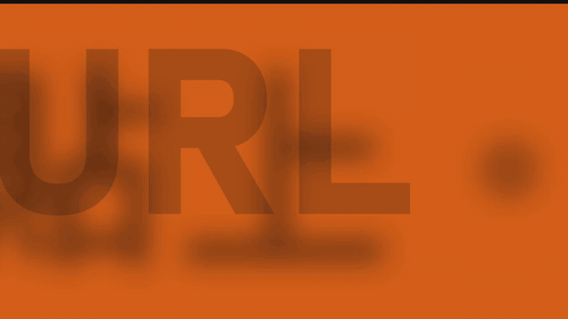
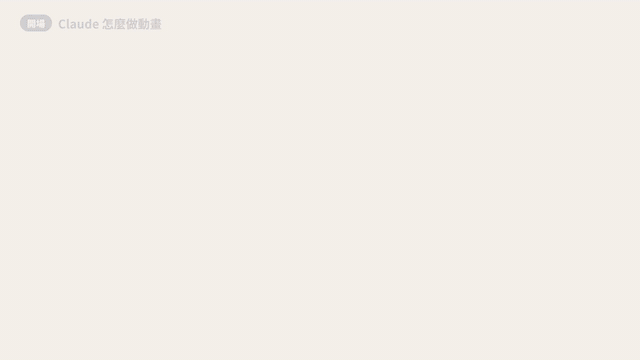

# motion-video — 一句話，讓 Claude 把一整支影片「寫」出來

你只要說：「幫我做一支 30 秒的產品宣傳片，要酷炫、抓眼球，放 IG。」

Claude 會先問清楚這支片要給誰看、要讓人記住哪一件事、要多有勁，然後自己設計分段、轉場與運鏡，把每一個畫面算出來，輸出成 MP4。你只負責看片、說哪裡要改。

## 看看做得出什麼

下面三段各 5 秒，都是這個 skill 做出來的片，沒有配樂、沒有後製。

**資料 showreel：** 一家虛構的獨立書店地圖，數字與畫面一起長出來


**hype 廣告：** 一個下載工具的宣傳片，開頭三個字抓住眼睛



**說明動畫：** 一支教你用 Claude 做動畫的教學片，邊講邊畫



## 它能做哪幾種片

- **介紹廣告、hype 廣告：** 先問清楚能量是平靜、活潑還是 hype，再決定節奏
- **產品導覽片：** 用真實的產品畫面，畫面上的每個數字都追得到出處
- **資料 showreel：** 讓數字與資料自己長成畫面
- **旁白說明動畫：** 換段跟著旁白每一句的開頭
- **個人 / 作品集 reel**

## 為什麼不是「隨便生成一支」

- **先問再做：** 受眾、基調、底色、要記住的一件事，都是動手之前先定。「廣告」兩個字不夠決定片型，它會問，不會猜。
- **不亂編：** 畫面上的數字與功能都要對得上產品文件，並附一份對照表給你查。
- **動就要有理由：** 每個會動的東西都要寫得出「這個動作在說什麼」，沒有理由的就不動。
- **好不好看，由你決定：** 它會用量測工具檢查節奏與換段，但「好看、對味」一定是你看片後說了算。
- **規則有憑據：** 每一條規則都標了證據等級：作者看片的判斷、量測工具量到的數字、盲測 A/B 的結果，可以看出哪條是品味、哪條有量過。

## 開始使用

1. 把 `motion-video/` 整個資料夾複製到 Claude Code 的 skills 目錄：
   - Windows：`%USERPROFILE%\.claude\skills\motion-video\`
   - macOS / Linux：`~/.claude/skills/motion-video/`
2. 重開 Claude Code，然後說出你想做的片。

做片需要 Python 3.10 以上、`ffmpeg` / `ffprobe`（要在 PATH 上）與 Chromium。環境怎麼備齊，見下面的「安裝細節」。

<details>
<summary>安裝細節與驗證</summary>

安裝 Python 套件：

```powershell
pip install -r "$env:USERPROFILE\.claude\skills\motion-video\requirements.txt"
```

```powershell
python -m playwright install chromium
```

確認 `ffmpeg -version` 印得出版本。

（選用）旁白片的量測需要逐字稿：自己用任何語音辨識工具產生 `.srt` 後以 `--srt` 傳入，或把環境變數 `MV_ASR_EXE` 設成一個接受 `<video> --out <dir> --language zh --stem transcript` 的語音辨識指令。

每支量測工具（`make_beat_track.py` 除外）都有自我測試，用合成的正例與反例確認它會觸發、也不會誤觸：

```powershell
cd "$env:USERPROFILE\.claude\skills\motion-video"
```

```powershell
python -X utf8 scripts\density.py --selftest
```

最後一行印出 `SELFTEST PASS` 就代表套件與 ffmpeg 都裝好了；其他工具用同樣方式測。

觸發測試：

- **應該觸發**：「幫我做一支 30 秒的產品宣傳片，要酷炫、抓眼球，放 IG」
- **不應該觸發**：「這個按鈕的 hover 動畫 easing 要怎麼調」（單一元件動效，不是整支片）

</details>

<details>
<summary>資料夾內容與證據等級</summary>

| 路徑 | 說明 |
|---|---|
| `motion-video/SKILL.md` | 入口：工作順序、可以下的判定、交付時附的驗收清單 |
| `motion-video/references/` | 各主題規則：整支片規則、片型骨架、節奏 / 轉場 / 運鏡、建置與輸出、證據等級與量測工具、元件 spring 參數、「問產品負責人、別猜」的 prompt 附加段 |
| `motion-video/scripts/` | 21 支量測工具 (instruments)：拍點、換段、畫面動態比例、運鏡、形狀接續、底色切換、模糊轉場、閃白 / 色彩洗過、畫面遮幅、剪點跟哪條音樂事件流、導覽角色、spring 擬合、螢幕文字與產品比對、contact sheet 等 |
| `motion-video/requirements.txt` | Python 套件 |

證據等級 (evidence tier)：

- **author**：作者看片後的判斷（一個人的品味紀錄；你自己的裁定優先）
- **measured**：校準過的量測工具在來源影片上量到的數字
- **verified**：經過盲測 A/B 回合、兩組範圍不重疊
- **unvalidated**：在來源影片量過，但還沒用模仿測試驗證
- **observed**：模型讀過來源影片的 frame sheet 的觀察，沒有校準過的量測工具、也沒做模仿測試
- **claim**：他人（創作者、從業者）的說法，這裡沒量過

文中的 `Cnn`（來源影片）、`Tnn`（技法卡）、`rNN`（模仿回合）是作者私人實驗室的紀錄編號，只作出處標籤；實驗室本身沒有附上，附上的是其中通用的量測工具。

</details>

## 授權

MIT，見 [LICENSE](LICENSE)。審片流程的部分做法參考了 [reelmimic](https://github.com/edenfunf/reelmimic)，文中以 `[reelmimic]` 標註。
